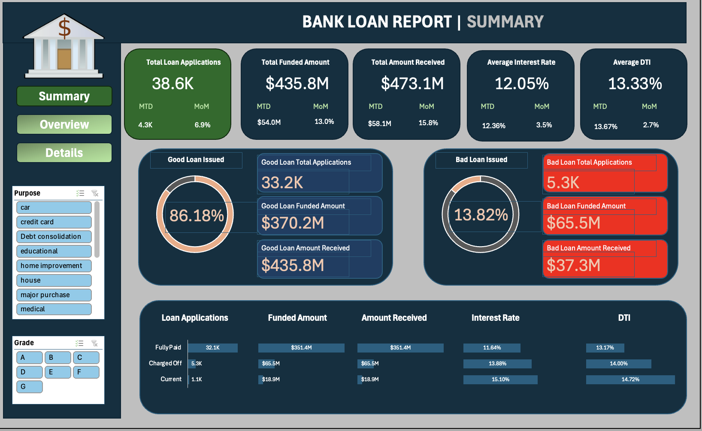
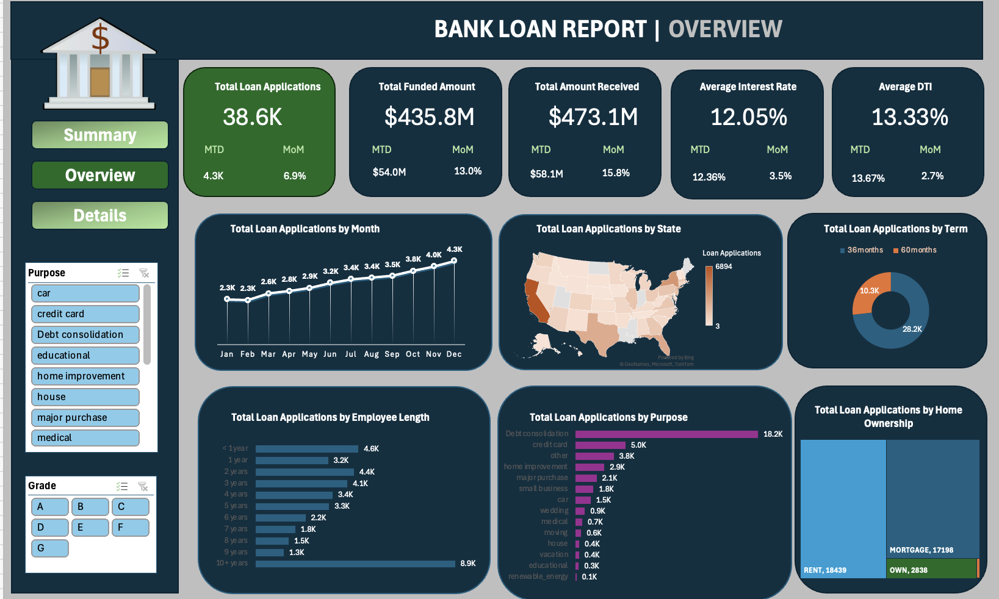
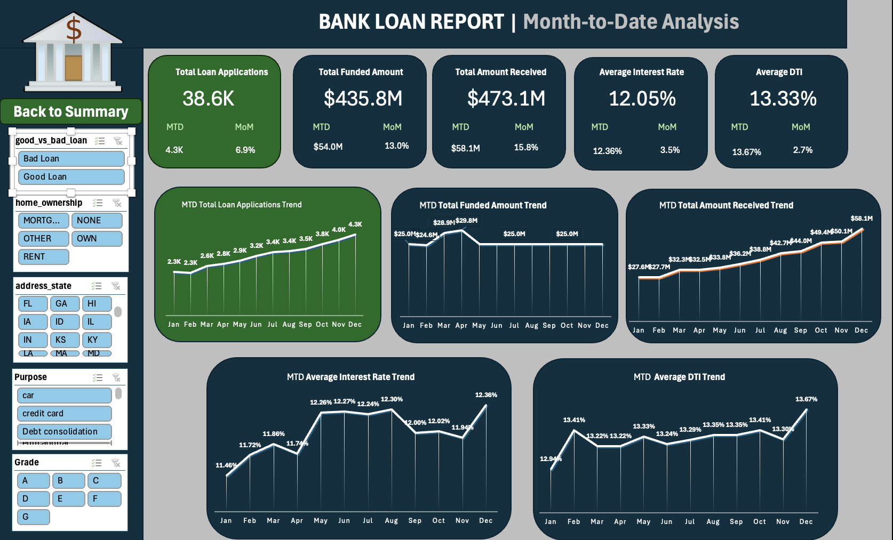
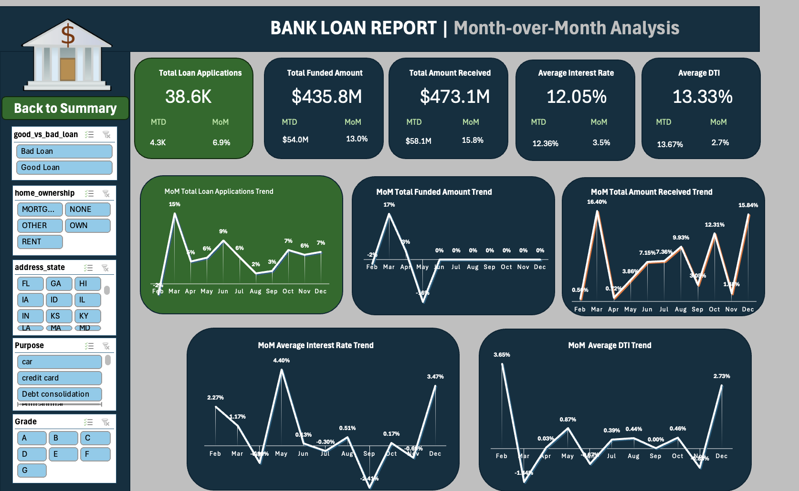

# Bank Loan Report Project

## Introduction
Welcome to the Bank Loan Report Project repository! This project is designed to provide a comprehensive analysis of our bank's lending activities, helping us monitor, assess, and optimize our loan portfolio. By utilizing various dashboards and visualizations, this project aims to deliver actionable insights into key loan metrics, loan performance, and overall portfolio health.

**_Disclaimer_** : _All datasets and reports do not represent any company, institutiion or country, but just a dummy dataset to demonstrate capabilities of Microsoft Excel._

## Data Sources
**Financial Loan Data**: The primary dataset used for this analysis is the "financial_loan.csv" file, containing detailed information about each loan issued by the company.

## Tools
•	**Excel** - Data processing and Dashboard Creation

## Data Cleaning/ Processing
The dataset is already cleaned an ready to use. I have created new columns of "good_vs_bad_loan" based on "loan_status" column.

## Problem Statement
1.  What are the total and Month-to-Date (MTD) loan applications and their trends Month-over-Month (MoM)?
2.  What are the total, MTD, and MoM changes in the amount of funds disbursed and received?
3.  What are the average interest rates and Debt-to-Income (DTI) ratios overall, MTD, and MoM?
4.  What percentage of loans are classified as 'Good' versus 'Bad'?
5.  How do loan metrics vary by state, loan term, employment length, loan purpose, and home ownership status?

## Exploratory Data Analysis
EDA involved exploring the financial loan data to answer the key questions mentioned above, such as trends in loan applications, funding amounts, interest rates, and DTI ratios over time.

## Skiils/ Concepts Demonstrated
### Excel Features Utilized:
1.  PivotTables
2.  Conditional Formatting
3.  Charts and Graph (including line charts, bar charts, donut charts, and filled maps)
4.  Formulas and Functions
   
### Data Analysis Tools/Techniques:
1.  Trend Analysis
2.  Geographic Analysis
3.  Categorical Analysis
4.  Performance Metrics 

## Visualization
This project comprises 2 dashboards:
1.  Summary Dashboard
2.  Overview Dashboard
3.  Month-to-Date Dashboard
4.  Month-on-Month Dashboard

You can interact with the dashboard [here](https://onedrive.live.com/edit.aspx?resid=810575755AC07AA7!sf2152d39f6a64c7ab9810d4d79e45c7a&migratedtospo=true&wdorigin=OFFICECOM-WEB.START.UPLOAD&wdprevioussessionsrc=HarmonyWeb&wdprevioussession=580c85e9-e916-4f07-84db-ab34cd8274d7&wdenableroaming=1&wdodb=1&wdlcid=en-US&wdhostclicktime=1725948872043&wdredirectionreason=Force_SingleStepBoot&wdinitialsession=2c31532d-96c3-3d23-0f2a-8e925233dfd0&wdrldsc=1&wdrldc=2&wdrldr=InternalError)

## Analysis
### 1.  Summary Dashboard

1. The total number of loan applications stands at 38.6K, of which 33.2K are classified as good loans and 5.3K as bad loans. This indicates that a majority of the loans fall under the good loan category, reflecting positive performance.
2. The total funded amount across all loans is $435.8M, with $370.2M of that total funding good loans and $65.5M allocated to bad loans.
3. The total amount received from these loans is $473.1M, with $435.8M from good loans and $37.3M from bad loans, suggesting that good loans contribute significantly to the revenue stream.
4. The average interest rate across all loans is 12.05%, showing consistency in the pricing of loans, while the average Debt-to-Income (DTI) ratio is 13.33%, indicating the general financial standing of borrowers.

### 2.  Overview Dashboard

1. **Steady Increase**: Loan applications increased from 2.3K in January to 4.3K in December.
2. **Top-Performing State**: California (CA) leads in loan applications.
3. **Loan Purpose**: Debt consolidation accounts for 18.2K applications, the most common reason.

### 3.  Month-to-Date Dashboard

1. In the month of December, there were 4.3K loan applications, reflecting the highest monthly application volume for the year.
2. The MTD total funded amount in December was $54.0M, indicating an upward trend in the allocation of funds to borrowers as the year progressed.
3. The MTD total amount received in December reached $58.1M, showing a substantial inflow of funds and successful loan repayments.
4. The MTD average interest rate for December was 12.36%, which is slightly higher than the yearly average, suggesting an uptick in interest rates during the last month of the year.
5. The MTD average DTI ratio rose to 13.67% in December, representing the highest DTI ratio of the year and indicating that borrowers' debt levels were at their peak during this time.

### 4.  Month-on-Month Dashboard

## Findings

# Recommendation

## Limitations
The dataset is based on a simulated environment and may not reflect real-world dynamics. The analysis is for demonstration purposes.

## References
1. Data Tutorials (Youtube Channel)

